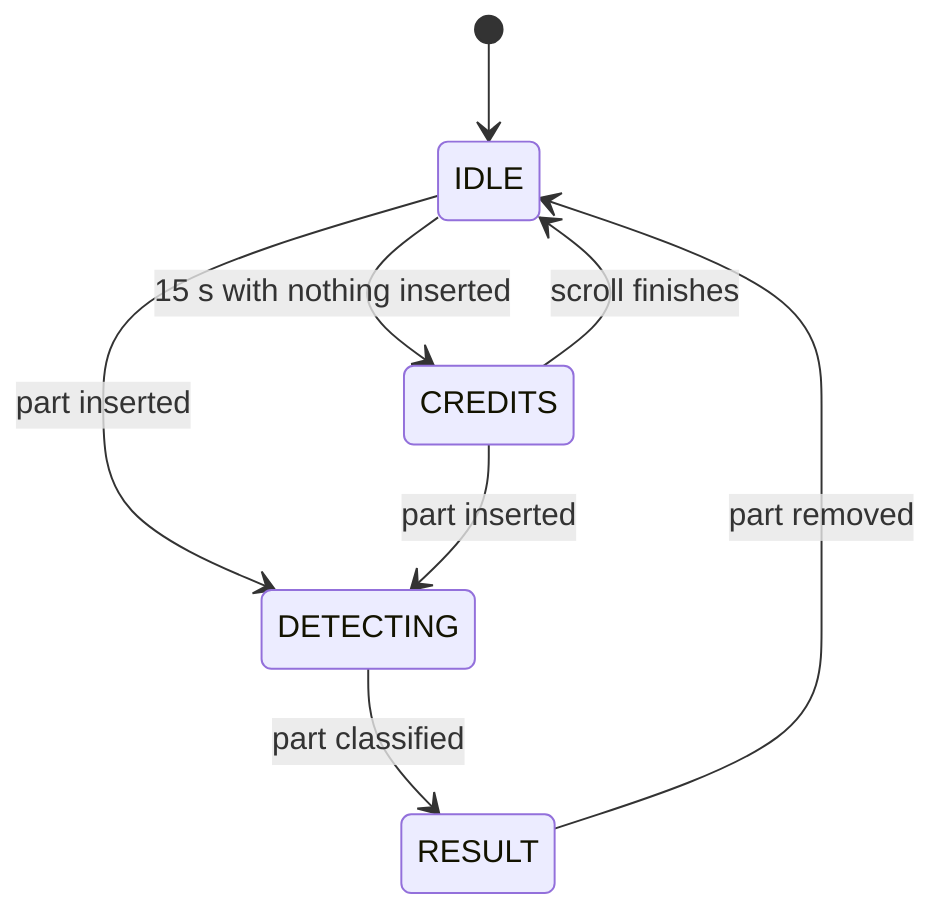

# Daedrix

**A pocket component analyzer built on an STM32 Blue Pill.**
Drop a resistor, diode or LED into the socket and Daedrix tells you what it is and what it measures. 


<!-- Add a photo or GIF once you have one, then uncomment:

-->

## What it does

Plug a part into the ZIF socket and the OLED shows:

| Component | What you see |
|---|---|
| Resistor | Resistance (in R, K or M), test current |
| Diode | Forward voltage, test current, polarity |
| LED | Forward voltage, test current, polarity |

Parts can go in either way round. Daedrix tests both directions and works out the polarity itself. Take the part out and it goes back to an idle screen.

## How it works

Two Blue Pill pins (PA1 and PA2) each drive one side of the socket through a 1 kΩ resistor. Two more pins (PA3 and PA4) read the voltage at each side of the part with the ADC.

```
Forward:   3.3V ─ PA1 ─[1k]─ A ── part ── B ─[1k]─ PA2 ─ GND
                            │            │
                           PA3          PA4        (ADC sense)

Reverse:   the same, with PA1 and PA2 swapped
```

Each side of the socket also has a pair of 1N4148 clamp diodes, one to 3.3 V and one to GND, so a stray voltage on the part can't reach the STM32 pins.

Firmware drives the circuit forward, then reverse, and looks at how much current flows each way:

| Current flows | Result |
|---|---|
| Neither way | Nothing in the socket |
| Both ways | Resistor. Resistance comes from the voltage across the part divided by the loop current |
| One way only | Diode or LED, told apart by forward voltage: 0.20 to 1.20 V is a diode, 1.20 to 3.30 V is an LED |

Anything outside those ranges is shown as UNKNOWN along with the raw readings, so you can see why.

### Firmware states



Removal is debounced. A part has to be missing for four checks in a row (about 0.8 s) before Daedrix leaves the result screen, so a slightly loose part doesn't make the display flicker.

## Hardware

| Part | Notes |
|---|---|
| STM32F103C8T6 "Blue Pill" | Runs everything |
| ST-Link V2 | Flashing |
| 0.96" SSD1306 OLED, 128×64, I2C | Display |
| 14-pin ZIF socket | Only two contacts are wired |
| 2 × 1 kΩ resistors | Current limiting and the measurement loop |
| 4 × 1N4148 diodes | Clamp protection, two per side |
| Breadboard and jumper wires | No soldering needed |

### Pin map

| Function | Pin |
|---|---|
| Drive A | PA1 |
| Drive B | PA2 |
| Sense A (ADC) | PA3 |
| Sense B (ADC) | PA4 |
| OLED SCL | PB6 |
| OLED SDA | PB7 |
| OLED power | 3.3V and GND |

Some OLED boards label the pins VDD and SCK instead of VCC and SCL. They're the same thing.

<!-- If you host docs/wiring-diagram.html with GitHub Pages, link it here. -->

## Build and flash

1. Install the Arduino IDE.
2. Add the STM32 board index in **File → Preferences → Additional Boards Manager URLs**:
   `https://github.com/stm32duino/BoardManagerFiles/raw/main/package_stmicroelectronics_index.json`
3. In **Boards Manager**, install **STM32 MCU based boards**.
4. In **Library Manager**, install **Adafruit SSD1306** and **Adafruit GFX Library**.
5. Select **Generic STM32F1 series**, board part number **Blue Pill F103C8**, upload method **STLink**.
6. Open `firmware/daedrix/daedrix.ino` and upload.

Wire the ST-Link to the Blue Pill (3.3V, GND, SWDIO to PA13, SWCLK to PA14) and check the BOOT0 jumper is on 0. On Linux you may need udev rules for the ST-Link.

For debugging, open the serial monitor at 115200 baud. Every scan prints the raw readings in both directions.

## Known limitations

Daedrix is a learning project, not a lab instrument.

- **Low resistances are unreliable.** The fixed 1 kΩ pair dominates the loop, so a resistor of a few ohms drops only a few millivolts. Expect wrong readings below roughly 15 Ω, and anything under 5 Ω is reported as UNKNOWN.
- **Blue and white LEDs may not be detected.** With a 3.3 V supply and two 1 kΩ resistors in the loop, LEDs with a forward voltage close to 3.3 V barely conduct.
- **Classification uses forward voltage only.** It can't tell a Schottky diode from a low-voltage LED, for example.
- **Resistors only, not other parts.** Transistors, capacitors and inductors aren't supported and will read as something unpredictable.
- **No calibration step.** Accuracy depends on your actual resistor tolerances and ADC. Check readings against a multimeter before trusting them.

## Roadmap

These are ideas, not promises.

- [ ] Auto-ranging with a second, lower-value resistor pair for accurate low resistances
- [ ] Capacitor measurement using RC charge time
- [ ] BJT detection: NPN or PNP, pinout and hFE
- [ ] MOSFET detection
- [ ] Continuity mode with a buzzer
- [ ] DC voltmeter mode
- [ ] Simple calibration routine
- [ ] Move from breadboard to a soldered board or custom PCB, with an enclosure
- [ ] Battery power

## Repository layout

```
daedrix/
├── firmware/daedrix/daedrix.ino   Arduino sketch
├── docs/                          Photos and wiring notes
├── LICENSE
└── README.md
```

## Team

Built as a Semester 5 project for Microcontrollers (PBCST504) at Vidya Academy of Science & Technology, Kerala.

- Sreegovind P
- Shravan PD
- Sooraj Sunilkumar
- Midhun M

## License

MIT. See [LICENSE](LICENSE).
